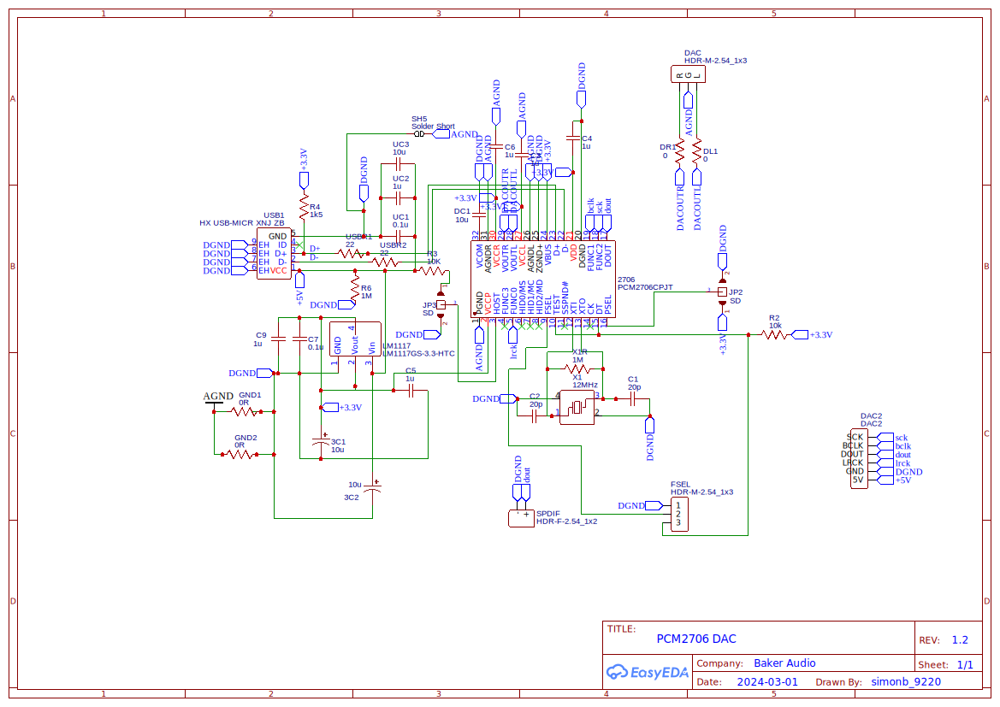

# PCM2706 DAC Build

# Schematic

## Introduction

The PCM2706C DAC from Texas Instruments is a versatile and high-performance digital-to-analog converter designed specifically for audio applications that require superb sound quality in a compact form factor. Integrating a USB 2.0 full-speed compliant interface, the PCM2706C simplifies the process of transmitting digital audio data from computers or other USB hosts, making it an ideal solution for us to use here.

Reasons for choosing this DAC for the board are:

    *   USB 2.0 Full-Speed Compliance: Ensures compatibility with a wide range of devices by meeting USB 2.0 standards for full-speed operation (12 Mbps), facilitating straightforward audio data transmission from USB hosts without requiring additional drivers
    *   Integrated USB Interface: Comes with an on-chip USB interface, including an oscillator and PLL, which simplifies the design by eliminating the need for external USB-specific components
    *   Plug-and-Play Functionality: Supports plug-and-play operation across various operating systems
    *   SPDIF Output: Features an S/PDIF (Sony/Philips Digital Interface) output for digital audio, allowing the PCM2706C to interface directly with other digital audio devices and systems
    *   On-Chip Clock Generator: Includes an on-chip clock generator with a single 12 MHz crystal source, which simplifies the circuit design by reducing the number of external components required
    *   Bus-Powered Capability: Can be powered directly from the USB bus, eliminating the need for an external power supply
    *   I2S: The I2S interface on the PCM2706C DAC allows for seamless daisy-chaining with another DAC, enabling complex audio system configurations and multi-channel audio applications by facilitating synchronous data transmission between devices

Performance wise, it's not the worlds best, but more on that later.  For now, it's good enough!

    *   Sampling Rates: Supports standard audio sampling rates including 32 kHz, 44.1 kHz, and 48 kHz, making it versatile for different audio playback quality requirements
    *   Total Harmonic Distortion + Noise (THD+N): 0.006% at a load resistance (RL) > 10 k for self-powered configurations, and 0.025% at RL = 32 ohms, showcasing its high fidelity in audio signal conversion
    *   Signal-to-Noise Ratio (SNR): 98 dB, indicating excellent audio signal clarity with minimal background noise
    *   Dynamic Range: 98 dB, providing a wide range of audio loudness without distortion, from the quietest to the loudest tones
    *   Output Power (PO): 12 mW at RL = 32 Ω, indicating the capability to drive headphones with sufficient volume levels
    *   Passband Ripple: ±0.04 dB, ensuring a flat frequency response within the passband for accurate audio reproduction
    *   Stop-Band Attenuation: –50 dB, effectively reducing unwanted frequencies beyond the audio band

We have exposed a jumpered position to toggle the outputs between I2S and S/PDIF.  I2S is ideal for direct digital interface with audio processors and DACs, offering high-quality stereo audio over a minimal number of lines. In contrast, S/PDIF is perfect for transferring digital audio signals over longer distances without degradation, commonly used in consumer audio equipment and home theaters.  BTW, you've not lived until you've experience the thrill of hooking up an LED to S/PDIF and shoving it into another piece of sound equipment.  It actually works...

## Daisy Chaining

You can daisy chain another DAC - we highly recommend the PCM5102A devices, available from AliExpress or other similar places.  Get one of these ones: https://raspberrypi.stackexchange.com/questions/76188/how-to-make-pcm5102-dac-work-on-raspberry-pi-zerow as the board is designed to let you simply piggyback it onto ours.

All the pins needed should be exposed.

