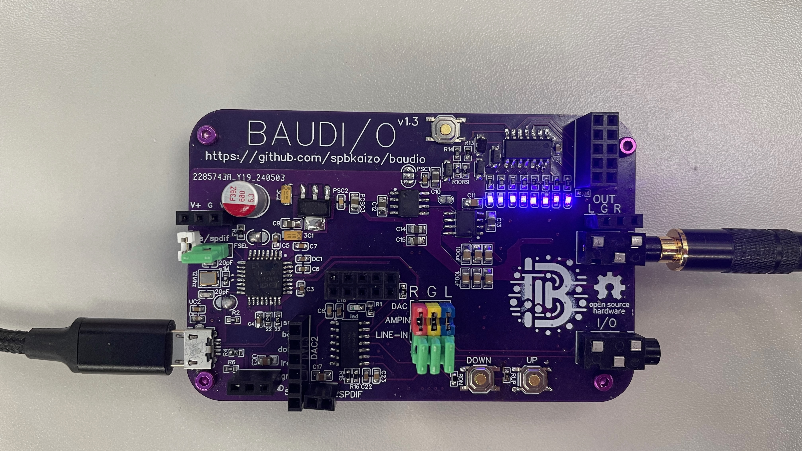
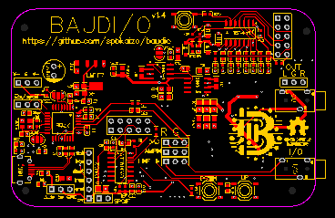

# BAUDI/O

## What is it?

An experiment in exactly how much can you cram into a business card PCB, for audio electronics.

It has a plethora of features, and opportunities for uses that I've not considered.

## DAC

At the heart of this is a PCM2706 DAC, which when connected via USB to a host will appear in the USB devices as a sound card, supporting up to 48kHz/16bit audio.  This is beyond CD quality, and before you start on the band waggon of 'yeah but muh 192kHz 24 bit...' pop over and read Monty's amazing article [here](https://people.xiph.org/~xiphmont/demo/neil-young.html) and then watch his equally epic videos on the subject.  

For more details on the DAC, have a look at [DAC.md](DAC.md)

## CMoy

The CMoy headphone amplifier, named after its inventor, Chu Moy, is a renowned DIY project within the audiophile community, celebrated for its simplicity and exceptional performance. Chu Moy introduced this design on HeadWize, a pioneering online forum dedicated to headphone enthusiasts, in the late 1990s. The amplifier is notable for its use of commonly available components, including operational amplifiers (op-amps) housed within an Altoids tin or similar small cases, making it both accessible and portable. The CMoy has become a rite of passage for DIY audio hobbyists, offering an affordable entry point into high-quality audio amplification. Its design principles encourage customization and experimentation, leading to numerous variations and enhancements by the DIY community. 

Yes, we've got one crammed in here.

For more details on this, have a look at [CMOY-HeadphoneAmp.md](CMOY-Headphone-Amp.md)

## Power Supply

Another use for this PCB is to provide accessible power, not for just the usual 3.3v/5v combination, but also a dual power supply of circa $\pm$ 5v.

For more details on the power supply, have a look at [Power-Supply.md](Power-Supply.md)

## MicroControllers

The ATtiny1614, part of Microchip's tinyAVR® 1-series, is a marvel of microcontroller efficiency and versatility, encapsulating the essence of what makes modern embedded systems so powerful. Despite its diminutive size, the ATtiny1614 boasts an impressive array of features that make it a go-to choice for hobbyists and professionals alike, working on compact and energy-efficient projects.

Firstly, its high processing power, courtesy of the AVR core running at up to 20 MHz, is remarkable. This speed, combined with a rich set of peripherals, including multiple analog-to-digital converters (ADCs), a digital-to-analog converter (DAC), and a versatile set of communication interfaces (USART, SPI, and I2C), provides a solid foundation for a wide range of applications, from simple LED controllers to more complex sensor networks.

We've got two of them on the board for you to play with.

We chose these, as they support the new programming interface known as UPDI.  UPDI operates over a single wire for programming and debugging, plus ground and optional power connections.  No more fighting with ISP cables or soic-8 clips!  With UPDI, you can program the flash, EEPROM, and even adjust fuse settings through the same interface used for debugging.

### Blinkenlighten

Now we start to delve into the fun side of things, we've got an array of 8 LEDs on the board, driven by an ATTiny1614 connected to both the left and right pre-amp audio sources.  And, in case you don't want this distraction, then the pins are broken out and accessible for your own code and use.

Source code and .hex file in the vu-meter directory.

### Digital Volume Control

The other attiny is used as a digital volume controller - but if you want to use an old school analogue potentiometer, you can.  Just don't populate this part of the board.  But, read on for why you should...

*   Digital pots can be adjusted with precise increments, allowing for exact resistance settings - no more channel imbalances!
*   You can program the microcontroller to switch between different resistance profiles or settings, enabling one device to perform multiple functions or adapt to different operating conditions.  Instead of simply doing n+1 you could cycle through pre-defined settings!
* You can save the previous settings to the eeprom, or have a default 'low' setting so you don't blow your ears out
* If, like me, you are a little more deaf in one ear than the other, you can implement balancing
* If you don't like the response curve, change it!
* Unlike mechanical analog pots, digital pots and microcontrollers are not subject to physical wear from adjustments, leading to a longer lifespan and higher reliability

At this point if you're still reading, then perhaps you're interested in building one.  Head over to the [FAQ.md](FAQ.md) to see how to get started!